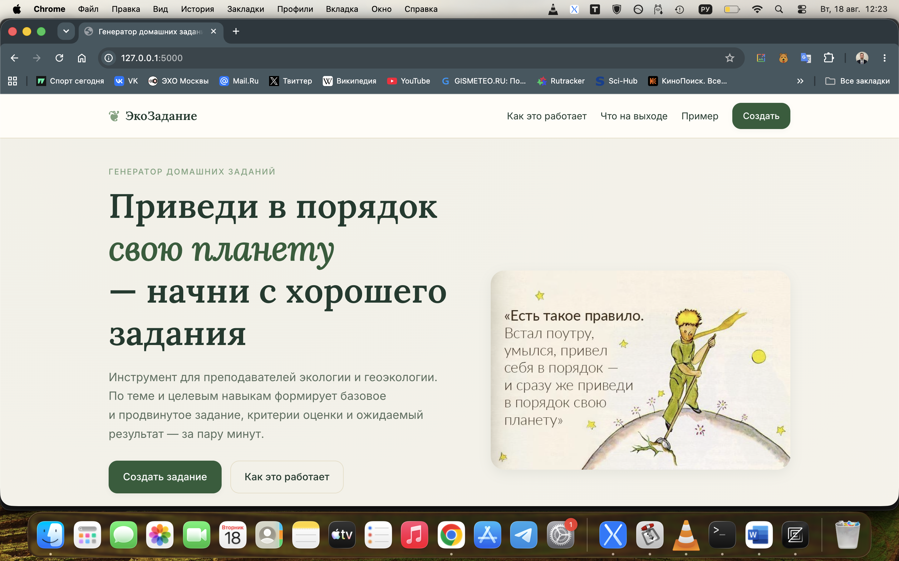
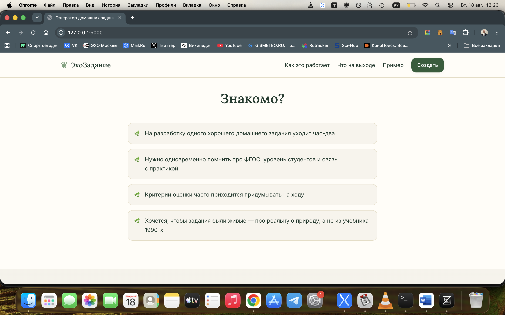
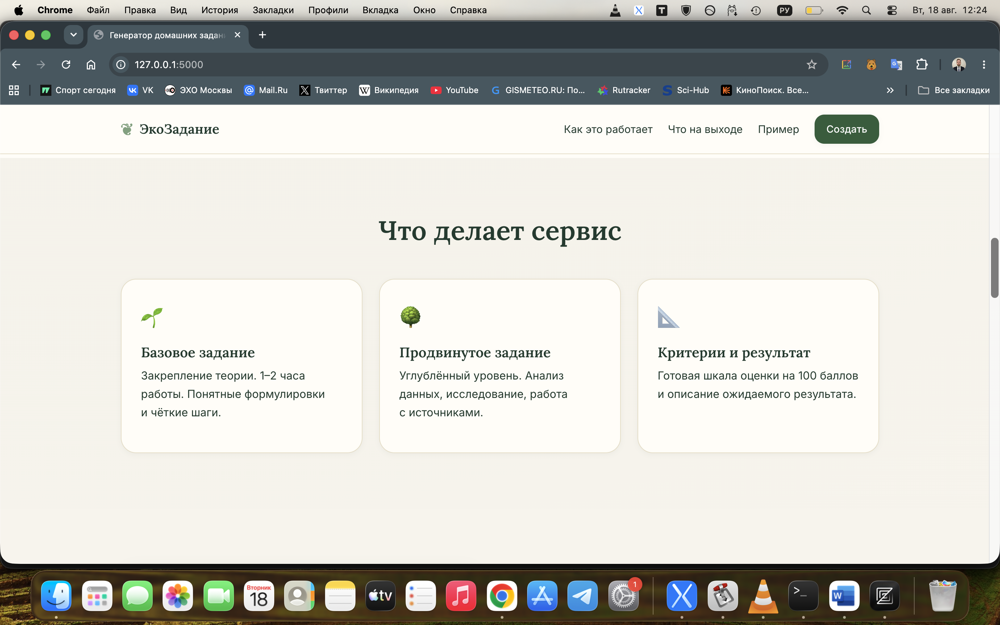
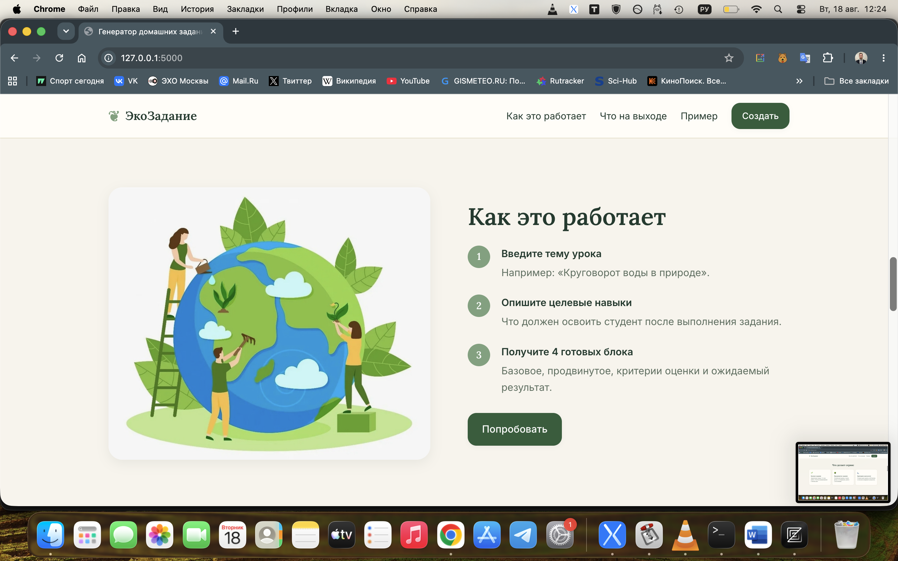
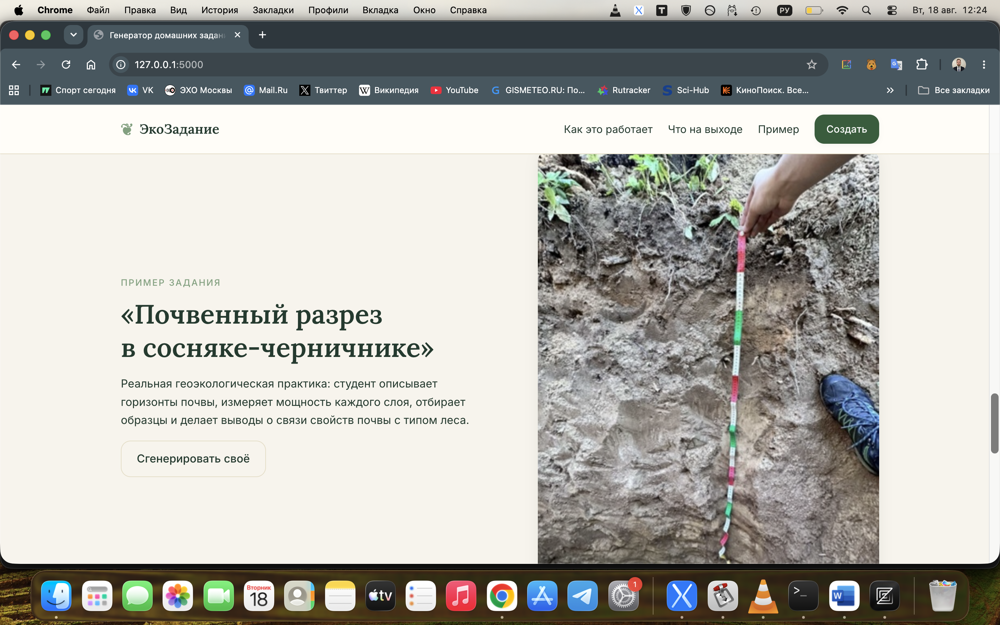
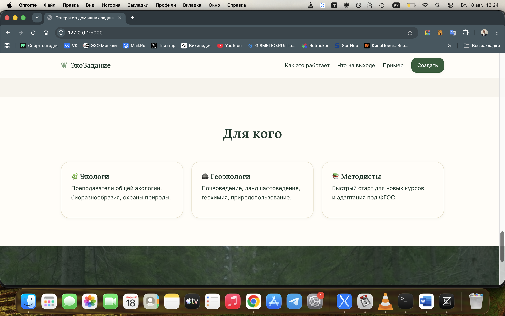
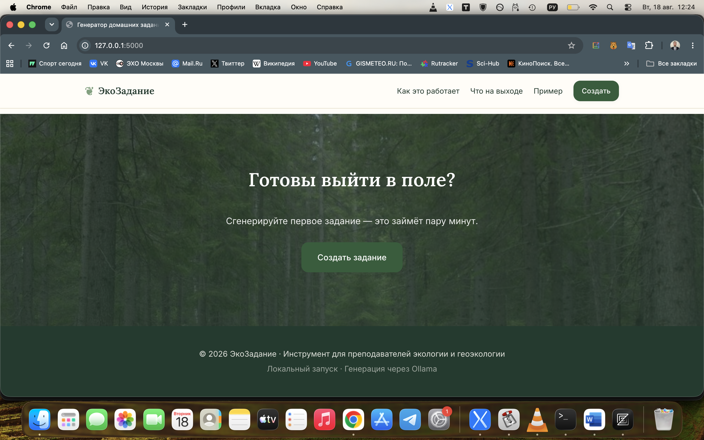
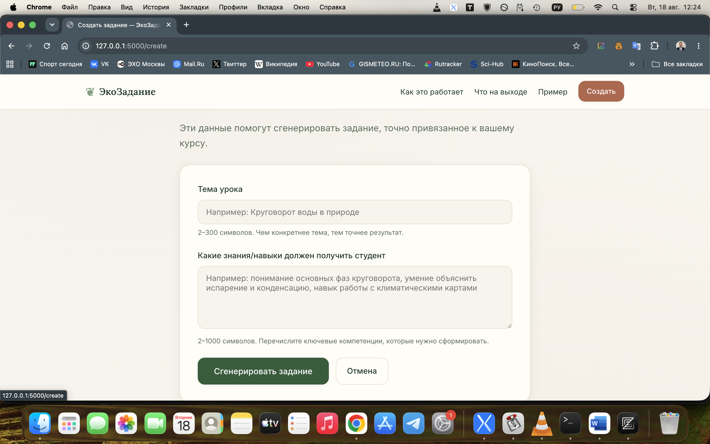

# ЭкоЗадание — Генератор домашних заданий

Локальный веб-инструмент для преподавателей экологии и геоэкологии. 



...

# Что он делает
По теме урока и целевым навыкам формирует:

- 📘 Базовое задание
- 📕 Продвинутое задание
- 📊 Критерии оценки
- 🎯 Ожидаемый результат


...

Стиль интерфейса — **Organic&Natural** (тёплая палитра, серифные заголовки, мягкие формы).

## Технологии

- Python 3.10+
- Flask 3
- Ollama (локальный LLM)
- Чистый HTML/CSS/JS

## Структура проекта

```
product-description-generator/
├── app.py                 # точка входа
├── requirements.txt
├── .env.example
├── config/config.py
├── app/
│   ├── __init__.py        # фабрика приложения
│   ├── routes.py          # маршруты
│   ├── services/
│   │   ├── llm_client.py  # обёртка Ollama
│   │   └── generator.py   # бизнес-логика
│   ├── models/schemas.py  # Pydantic-схемы
│   ├── prompts/           # шаблоны промптов
│   ├── templates/         # Jinja2
│   └── static/
│       ├── css/style.css
│       ├── js/main.js
│       └── images/        # 1.jpg, 2.jpg, 3.jpg, 4.jpg
└── tests/
```

## Локальный запуск

### 1. Установите Ollama

macOS: `brew install ollama` или скачайте с https://ollama.com
Затем запустите сервер:

```bash
ollama serve
```

В другом терминале скачайте модель (≈4 ГБ):

```bash
ollama pull gemma3:4b
# или другую лёгкую модель, напр. llama3.2:3b, phi3:mini
```

### 2. Клонируйте проект и установите зависимости

```bash
cd product-description-generator
python3 -m venv venv
source venv/bin/activate
pip install -r requirements.txt
```

### 3. Создайте `.env`

```bash
cp .env.example .env
```

Откройте `.env` и при необходимости укажите имя вашей модели:

```
LLM_MODEL=gemma3:4b
```

### 4. Запустите Flask

```bash
python app.py
```

Сайт будет доступен по адресу: **http://127.0.0.1:5000**

## Использование



...

1. Откройте главную — увидите лендинг с цитатой Сент-Экзюпери.
2. Нажмите «Создать».
3. Заполните тему урока и целевые навыки.
4. Подождите 30–90 секунд (локальная модель думает).
5. Получите 4 готовых блока — можно скопировать.




...

## Тесты

```bash
python -m pytest tests/
```

## Лицензия

MIT
